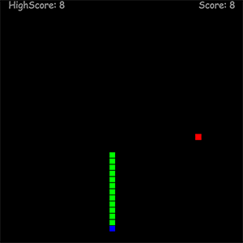

# Shnake - PoC for Monero in-game mining (Coinhive)

Shnake is proof-of-concept and a very hacky realisation of Snake game.

## How it's look?

Shnake can be fully customized, but I prefer to use old-school rectangle style.

## Rules

* Each food have random generated nutritional value (energy). 
* No new food will be generated until old not fully eaten and digested.  
* Speed of the Shnake will be increased during the food digestion. :scream:  
* The assimilation speed of food depends on the speed of resolving the Monero hashes.  

## How can I try this incredible thing?
:exclamation::exclamation::exclamation:CoinHive currently blocked by AdBlock and other browser ad-blocking extensions, so, please, disable AdBlock first.:exclamation::exclamation::exclamation:

Already disabled? No problem! Here is a link: https://kami4ka.github.io/Shnake/index.html